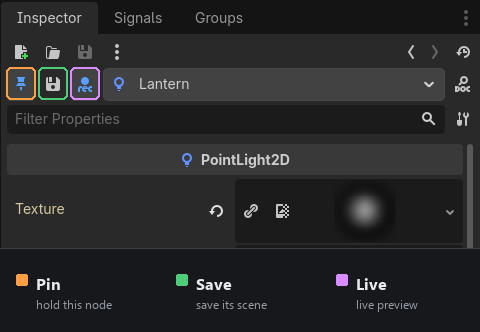
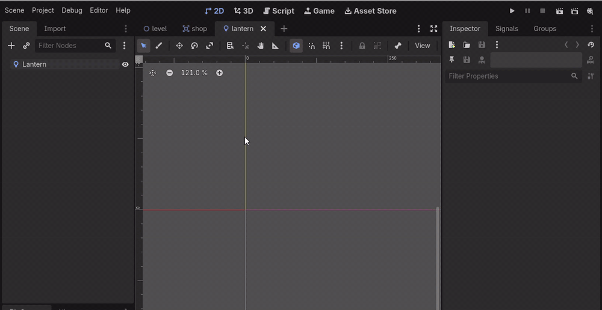

# Inspector Pin

**Pin the Godot Inspector to one node, so it stops following your selection.**

 

The Inspector always shows whatever is selected right now. That is usually what
you want — until you need to look at one scene while editing a node that lives
in another. Then you are stuck bouncing between tabs, changing a value in one and
checking the result in the other.

Inspector Pin adds the option that is missing: **pin the panel to a node, and it
stays there.**

That one change retires a whole workaround. You no longer switch on **Editable
Children** just to reach a light buried inside an instanced scene. You tune that
node's parameters under the level's real lighting, next to everything else that
is actually in frame, and the result updates as you drag — no tab switching, no
guessing how it will look once assembled.

And because you are editing the node in its own scene rather than the copy sitting
in the level, the value is written where it belongs. It reaches every instance of
that scene, instead of being buried in this one level as an override.



---

## The problem it solves

You have a level with its lighting set up — an evening `CanvasModulate`, say. You
drop a building into it, and the building scene has its own lights.

Now tune those lights. Inside `building.tscn` there is no evening tint, so the
lights look nothing like they will in the finished level. So you tweak the
energy, switch to the level tab, look, switch back, tweak again. Every single
adjustment costs two tab switches.

With Inspector Pin: open the building, pin the light, switch to the level tab
once. **The viewport shows the level; the Inspector still shows the light.** Drag
the slider and watch the real result.



### Why not Editable Children?

Godot already lets you reach inside an instance: right-click it, switch on
**Editable Children**, and its nodes become selectable in the level. For nudging
one particular copy — moving a lamp a few pixels in this room only — that is
exactly the right tool.

It is the wrong tool for tuning the source. Everything you change there is stored
as an **instance override in the level scene**, not in the scene you are actually
trying to author. The building keeps its old light. So does every other level
that uses it. Now the same value lives in five places and you get to remember
which one is real.

Switch it on across a project and the overrides accumulate quietly, until the
source scene is no longer the source of truth and nobody is sure which scene to
edit.

Inspector Pin never opens the instance. You edit the node in its own scene, the
value lands in the file it belongs to, and every instance of it — here and
everywhere else — picks it up.

---

## The three buttons

They sit in the Inspector header, to the left of the node-name dropdown.

| Button | What it does |
| --- | --- |
| **Pin** | The Inspector keeps showing the pinned node while you select other nodes and switch scene tabs. Click again to release. |
| **Save** | Saves the scene the pinned node belongs to, and rebuilds its instances — without making you switch to its tab. |
| **Live** | Mirrors your edits into instances of that scene in the scene you are looking at, then auto-saves shortly after. This is what makes the preview live. |

### Pin

Select a node, click the pin. From then on the scene tree and viewport behave
normally — selection still moves — but the Inspector holds its ground.

Drilling into a sub-resource still works. Click a `Material` or `Texture`
property and the Inspector navigates into it as usual; the pin only steps in when
the *selection* changes. Closing the pinned node's scene releases the pin on its
own.

### Save

Godot refreshes instanced sub-scenes only when their scene is saved as the
current tab. This button does that for you: it switches over, saves, and switches
back. The viewport flips briefly, which is a fair trade for a deliberate click,
and it picks up structural changes that the live preview cannot.

### Live

Toggle this on for continuous adjustment — picking a hue, dialling in an
intensity. Each edit is copied straight into the instances in the open scene, so
the viewport updates as you drag. The source scene is written to disk shortly
after you release the mouse.

---

## Install

**From the Asset Library:** search for *Inspector Pin* in the editor's AssetLib
tab, install, then enable it in **Project → Project Settings → Plugins**.

**Manually:**

```bash
git clone https://github.com/PershinAleksey2207/Godot_Inspector_Pin.git
```

1. Copy `addons/inspector_pin/` into your project's `addons/` folder.
2. Enable **Inspector Pin** in **Project → Project Settings → Plugins**.

No autoloads, no project settings, no scene changes. The addon only adds three
buttons to the editor.

---

## How it works

Worth knowing if you plan to modify it, or if something misbehaves.

**Holding the Inspector.** The pin listens for `selection_changed` and for scene
tab changes, and calls `EditorInterface.inspect_object()` on the pinned object
afterwards — deferred, so it lands after the editor's own handler rather than
before it. It re-inspects only when the Inspector has actually drifted off the
pinned object, which is what keeps sub-resource navigation and expanded sections
from being reset.

**Finding the header.** The buttons are inserted next to the node-name dropdown,
located by class name rather than by child index, so a reshuffle of the header
cannot quietly put them somewhere else. Godot 4.7 renamed that widget from
`EditorPath` to `EditorObjectSelector`; both names are tried. If neither is found
the addon installs nothing and writes a warning describing the dock, instead of
guessing.

**Detecting edits.** By polling, not by signal. `EditorInspector.property_edited`
looks like the right hook but is not dependable: property editors that stream
intermediate values — the colour picker above all — mark them as *changing* and
stay silent until the popup closes. So while the pin and live preview are both
on, the addon snapshots the pinned node's storable properties and compares them
each frame. That catches every edit as it happens whatever the editor reports,
and picks up undo/redo for free. Object-valued properties are reduced to instance
ids, so the snapshot never holds references to resources.

**Updating the viewport.** Instances of a scene are separate objects from the
nodes in that scene's own tab, so editing one does not touch the other. Live
preview copies the changed property into every matching instance in the open
scene, addressing them by the pinned node's path relative to its scene root.

**Saving.** Godot has no "save that one open scene" call. The manual button
switches tabs, because that is what triggers a real instance rebuild. Auto-save
uses `save_all_scenes()` instead — it leaves the tabs alone, and the viewport is
already correct because live preview updated it as the value changed.

---

## Known limitations

- **Auto-save writes every open scene that has unsaved changes**, not only the
  pinned node's scene. That is the cost of not switching tabs; see above.
- **The Save button never greys out on an unmodified scene.** Godot does not
  expose a scene's modified flag to scripts. Pressing it anyway is harmless.
- **The pin does not survive an editor restart.** It is deliberately transient.
- **Live preview mirrors property values, not structure.** Adding or removing
  nodes in the pinned node's scene needs the Save button to show up in instances.
- **While live preview is on and the source is not yet saved**, the open scene
  holds newer values than the file. Saving the *open* scene during that window
  would record them as instance overrides. The auto-save closes the window within
  a fraction of a second, but it is worth knowing it exists.

---

## Compatibility

Developed and tested on **Godot 4.7**. The header lookup handles the
`EditorPath` → `EditorObjectSelector` rename, so earlier 4.x versions should work
too, though they have not been tested. If the buttons do not appear, check the
editor log — the addon reports what it found in the Inspector dock.

---

## Bugs and ideas

If the buttons do not show up, or the pin behaves oddly on a Godot version I
have not tried, please
[open an issue](https://github.com/PershinAleksey2207/Godot_Inspector_Pin/issues)
— include your Godot version and anything the editor log said.

## License

MIT. See [LICENSE](LICENSE).
